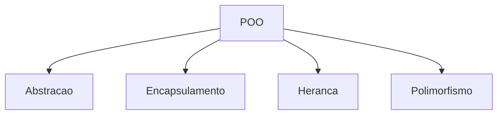
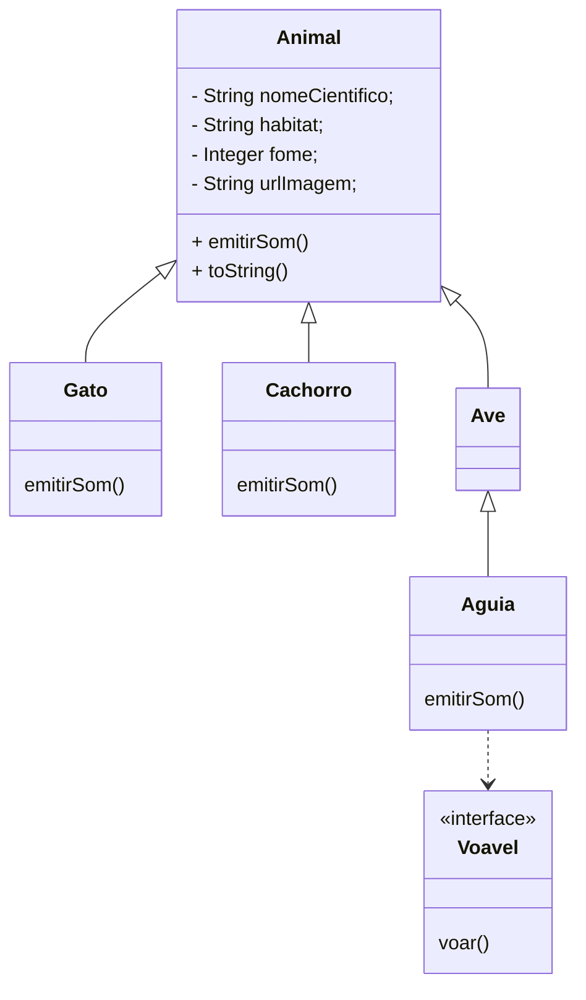

## Introdução à Orientação a Objetos

# POO INTRO

## Abstração

A POO preconiza a criação de obsjetos moldados em objetos do mundo real; desta maneira o entendimento das relações e interações tornam-se mais tangíveis e compreensíveis.

Porém, não se pode modelar com 100% de exatidão os objetos do mundo real; então é necessário restringir apenas os atributos e comportamentos necessários para o modelo de domínio de nosso software.

Esta restrição na seleção para o modelo dos objetos é o chamamos de `Abstração`.

## Encapsulamento

O Encapsulamento serve para controlar o acesso aos atributos e métodos de uma classe. É uma forma eficiente de proteger os dados manipulados dentro da classe, além de determinar onde esta classe poderá ser manipulada.

Também é utilizado para prover uma forma única de acesso aos atributos de uma classe, assim como encapsular comportamentos na atribuição de dados.

### Tipos de modificadores de acesso

| MODIFICADOR     | CLASSE | PACOTE | SUBCLASSE | GLOBALMENTE |
| --------------- | ------ | ------ | --------- | ----------- |
| Public          | SIM    | SIM    | SIM       | SIM         |
| Protected       | SIM    | SIM    | SIM       | NÃO         |
| Sem modificador | SIM    | SIM    | NÃO       | NÃO         |
| Private         | SIM    | NÃO    | NÃO       | NÃO         |

## Herança 

A Herança possibilita um projeto de classes que possam compartilhar atributos e comportamentos; fazendo com que o reaproveitamento de código seja mais efetivo e simplificado.

Podemos criar classes de base e fazer com que o código base seja `passado` às classe que a extendam.

## Polimorfismo

